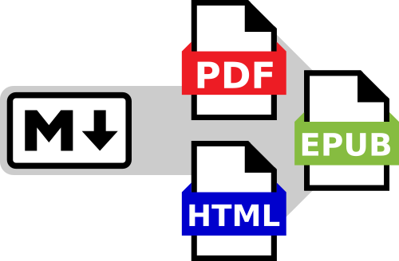

# Polytexy



Command-line utility that converts Markdown files into well-formed PDFs, EPUBs, and stand-alone HTML files.

## Features

* Polytexy's generated PDF files use the [Humanize](https://github.com/ShenZhouHong/latex-essay) LaTeX documentclass, a best-in-class LuaLaTeX template for academic typesetting.
* Polytexy outputs EPUB files with properly formatted tags and metadata, allowing for easy use and distribution on mobile devices.
* Stand-alone HTML files with embedded fonts allows for content to be shared on static site servers.

## Installation

Polytexy is a bash script which uses `pandoc`, `latexmk`, `lualatex`, and `python` in order to convert markdown documents into well-formed PDFs, EPUBs, and stand-alone HTML files. In order to use polytexy, first make sure that all dependencies are installed and available:

```bash
sudo apt install pandoc latexmk texlive
```

Next, ensure the `polytexy` file is given executable permissions.


```bash
sudo chmod +x polytexy
```

The `polytexy` script is now ready for use. In order to have the command available for the user, ensure that the directory is available within your `$PATH`. This can be done by adding the following line to your `~/.bashrc` file:

```bash
# Append the polytexy directory to the user's $PATH
PATH="/path/to/polytexy":$PATH
```

Now run `source ~/.bashrc` or restart your terminal, in order to have the changes take effect.

## Usage

Polytexy takes one (or more) markdown files as inputs, and converts them into PDF, HTML, and EPUB files.

```
Polytexy: Markdown to PDF, HTML, & EPUB Converter
    Usage: polytexy.sh file1.md [file2.md ...]
    Convert one or more .md files to .pdf, .html, & .epub (w/ pandoc)
```

For a quick test, you may run `polytexy` on the provided `example.md` file in this repository.

```
polytexy example.md
```

The utility will generate `example.pdf`, `example.html`, and `example.epub`.

## Markdown Metadata

In order to generate the output files with the correct metadata, `polytexy` requires additional information specified as a `yaml` file at the beginning of every markdown document. The following snippet is an example of the metadata fields supported.

Note that some fields such as `title`, `author`, and `date` are required.

```yaml
--- 
# General document information (title, author, and date required)
title: Test Document 1
subtitle: Test document subtitle
author: # Supports both single author value, or list of multiple authors
    - John Smith
    - Jane Doe
description: |
    File description test string.
date: 2020-12-26
lang: en-US

# PDF/A metadata (all optional)
url_link: https://example.com/
git_link: https://example.com/

# LaTeX specific options (all optional)
documentclass:
    - protrudelabels    # Remove to disable label protrusion
    - onehalfspacing    # or doublespacing, singlespacing
    - extraligatures    # Remove for less decorative ligatures
    - notitlepage       # or titlepage
    - widemargins       # For LaTeX-style wide margins. Remove for narrower margins
    - nosectionnumbers  # Disable section numbering
    - a4paper
maketitle: true
maketoc: true
tocpage: false          # Set the table of contents on its own page.
omitdate: false         # Do not typeset the date in the title
omitauthor: true        # Do not typeset the author in the title
csquotes: true
---
```

## License and credits

Polytexy is available under AGPLv3.

Polytexy depends on [pandoc](https://github.com/jgm/pandoc), a universal document converter written by John MacFarlane. Pandoc is licensed under GPLv2.

