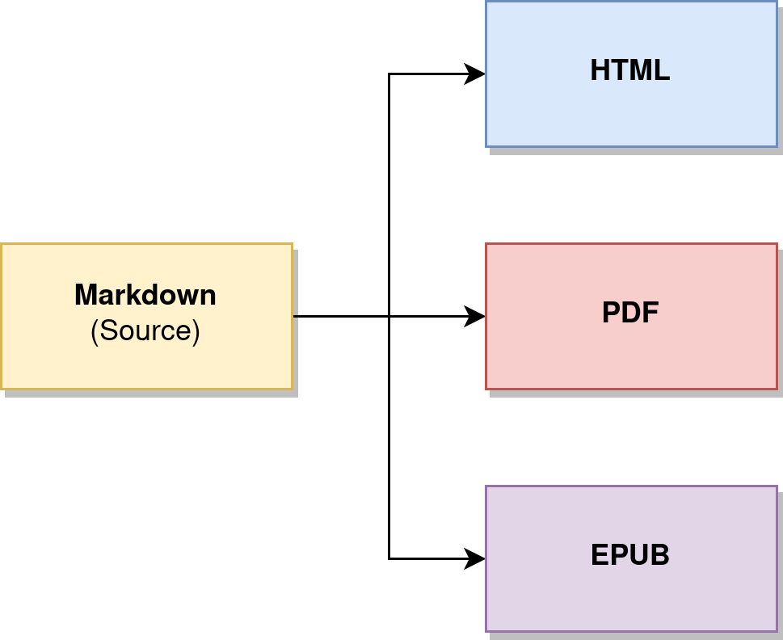

# polytexy



Command line tool that automatically converts markdown files into PDFs, EPUBs, and self-contained HTML files.

Usage:

```
Polytexy: Markdown to PDF, HTML, & EPUB Converter
    Usage: polytexy.sh file1.md [file2.md ...]
    Convert one or more .md files to .pdf, .html, & .epub (w/ pandoc)
```

Example:

```
./polytexy example.md
```

## Markdown Metadata

```yaml
--- 
title: Test Document 1
subtitle: Test document subtitle
author: Shen Zhou Hong
description: File description test string.
date: 2020-12-26
lang: en-US
csquotes: true
url_link: https://example.com/
git_link: https://example.com/
---
```